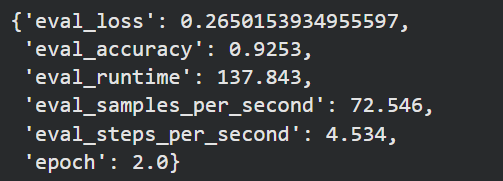
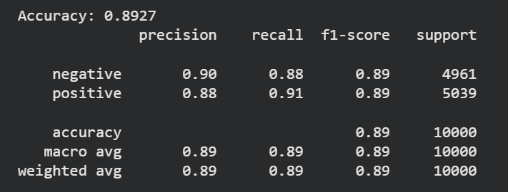

# Sentiment Analysis: TF-IDF vs BERT

This project explores sentiment analysis using both classical machine learning and modern transformer-based approaches. The goal is to compare the performance between a traditional NLP pipeline and a deep learning model.

## Project Overview

Sentiment analysis is a common Natural Language Processing (NLP) task that aims to classify text based on emotional tone, such as positive or negative sentiment.

In this project, I implemented and compared two different approaches:

1. TF-IDF + Logistic Regression (classical NLP pipeline)
2. BERT fine-tuning (transformer-based deep learning model)

The comparison helps illustrate how modern transformer models outperform traditional feature-based methods.

---

## Models Used

### 1. TF-IDF + Logistic Regression
- Text is converted into numerical features using TF-IDF.
- Logistic Regression is used as the classifier.

Advantages:
- Simple
- Fast
- Easy to interpret

Limitations:
- Does not capture word context
- Treats words independently

---

### 2. BERT

This project fine-tunes the pretrained **BERT (Bidirectional Encoder Representations from Transformers)** model for sentiment classification.

Advantages:
- Understands context between words
- Captures semantic meaning
- Pretrained on large text corpora

---

## Dataset

Dataset used: **IMDb Movie Reviews**

Task:  
Binary sentiment classification

Labels:
- Positive
- Negative

Each review is labeled with its corresponding sentiment.

---

## Methodology

### Data Preprocessing
- Text cleaning
- Tokenization
- Train-test split

### TF-IDF Pipeline
1. Convert text to TF-IDF vectors
2. Train Logistic Regression classifier
3. Evaluate accuracy

### BERT Pipeline
1. Tokenize text using BERT tokenizer
2. Convert dataset into HuggingFace Dataset format
3. Fine-tune BERT using HuggingFace Trainer
4. Evaluate model performance

---

## Results

| Model | Accuracy |
|------|------|
| TF-IDF + Logistic Regression | ~89% |
| BERT | ~92% |

The results show that BERT significantly outperforms the classical TF-IDF approach because it captures contextual relationships between words.

---

## Key Takeaways

- Classical NLP methods like TF-IDF are fast and simple but lack contextual understanding.
- Transformer-based models like BERT can capture semantic relationships in text.
- Pretrained language models significantly improve performance in NLP tasks.

---

## Tools & Libraries

- Python
- Scikit-learn
- HuggingFace Transformers
- PyTorch
- Pandas
- NumPy

---

## Results
### BERT
 

### TF-IDF + Logistic Regression

